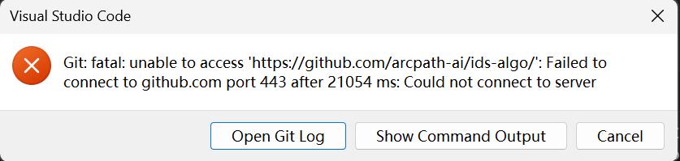

###  The records start from 11.27 workshop.

# WEEK 1 

## 1. Delete things

###  1.1 `unified_db `

* add_entities_from_properties_file   从实体定义文件添加多个实体  目前没有使用 似乎是用来添加实体的，后续用**URL 知识库**的形式进行代替
* add_property_sets_from_properties_file   从属性集定义文件添加多个属性集 与第一条类似
* add_attributes_from_properties_file   从属性定义文件添加多个属性    与第一条类似 在attribute.py里也有
* add_part_ofs_from_properties_file   从部分关系定义文件添加多个部分关系 与第一条类似 
* add_classifications_from_properties_file  从分类定义文件添加多个分类   在classification_db.py里也有

* add_materials_from_properties_file 从材料定义文件添加多个材料 

### 1.2 `part_of_db + classification_db + attribute_db `  

* add_part_of_from_properties_file 从部分关系定义文件添加多个部分关系
* add_classifications_from_properties_file  从分类定义文件添加多个分类
* add_attributes_from_properties_file 从属性定义文件添加多个属性

### 1.3 **`database_manager`**

* `get_entity_database   is_ready   get_main_database `  都是老版本的遗留？好像没有调用
* 和hot reload / reload 相关的代码 看起来似乎有用但是从来没用被调用出去
* `delete_knowledge_base` 
* `_unload_database`  卸载指定用途的数据库 没用到
* **`get_knowledge_base_status`**

* **`get_kb_manager`**  **`list_knowledge_bases`** **`backup_knowledge_base`**

**最后发现，和knowledge_service无关，如果不需要管理知识库，只需要完成映射的话，可以删去代码**

故最后删除了knowledge_service 整个文件！！


### 1.4 `knowledge_service `

下面这些功能在操作方面似乎是有用的，但是在直接生成pipeline过程中没有被调用，故删除 

* `delete_knowledge_base`
* **`get_knowledge_base_status`**
*  **`backup_knowledge_base`**
* **`install_knowledge_base`**

* **`reload_knowledge_base`**

最终删除发现剩下没多少了也没被调用，故整个删除。


### 1.5 `base.py`

* **`_encode_batch`**  批量将文本编码为向量（带缓存） 没有在别处被调用
* **`get_cache_info  + get_cache_stats + clear_cache +** 这几个函数只能说对于维护有帮助，但是对于生成的目前阶段无用

### 1.6 `matcher.py `

仔细观察我们会发现这个文件实际没有被调用QAQ

只是在`KnowledgeBaseMappingOrchestrator`中有，而从来没有被使用！

因此**detector** 和**matcher** 一起死掉！

### 1.7 `IFC-API-Client`

* **`compare_ifc_versions` ` search_entities`  ** 这两个是没有使用的 功能性函数

* **`get_concrete_entity_candidates`** 一是这个函数没有调用到，二是我认为似乎是在做resolver的事情，现在已经被LLM取代了

* **`is_concrete_entity`** 这是 在上面**`get_concrete_entity_candidates`**  中使用的！

* 实际上这个只在property_resolver中使用 我认为可以直接合并！！！ **已修改！！**

  

 ##  2. deep read function 

### 2.1 base.py 

* add_item 将项目添加到数据库 基本所有的类别都有这一项（抽象类导致）
  * `part_of_db + classification_db + attribute_db` 这些里面都含有add_item包装为 add_XXX
* 同时在unified_db 中存在 load函数， 被factory调用 来加载数据库  从而实现create_db
* 核心功能是**search**  抛开效率不谈，其中函数有：**`_filter_items_by_metadata`  ,`_encode_text`**

但是似乎存在一点代码问题？？

在search函数中：

> ##### 代码逻辑：
>
> 1. 先用 Python 列表推导式过滤 items (filtered_items)
>
> 2. 也是用 Python for 循环遍历每一个 item
>
> 3. 逐个从 index 里“重建”向量 (reconstruct)
>
> 4. 手动用 numpy 算点积 (np.dot)
>
> ```python
>  def search(
>         self,
>         query: str,
>         top_k: Optional[int] = None,
>         ifc_versions: Optional[List[str]] = ["IFC4"],
>         item_types: Optional[List[str]] = None,
>     ) -> List[Tuple[IFCItem, float]]:
>         """搜索与查询最相似的IFC项目
> 
>         Args:
>             query: 查询文本
>             top_k: 返回的结果数量
>             ifc_versions: 过滤的IFC版本列表
>             item_types: 过滤的项目类型列表
> 
>         Returns:
>             List[Tuple[IFCItem, float]]: 匹配项目和相似度得分列表
>         """
>         if not self.items:
>             logger.warning("知识库为空，无法执行搜索")
>             return []
> 
>         k = top_k or self.top_k
> 
>         # 根据元数据过滤项目
>         filtered_items = self._filter_items_by_metadata(
>             self.items, ifc_versions, item_types
>         )
>         if not filtered_items:
>             logger.warning("过滤后没有符合条件的项目")
>             return []
> 
>         # 对查询进行编码
>         query_vector = self._encode_text(query)
> 
>         # 直接在filtered_items中计算相似度
>         results = []
>         for item in filtered_items:
>             # 获取item在原始列表中的索引
>             item_idx = self.items.index(item)
> 
>             # 获取item的向量（从FAISS索引中）
>             item_vector = self.index.reconstruct(item_idx)
> 
>             # 计算相似度（使用内积）
>             similarity = float(np.dot(query_vector, item_vector))
> 
>             results.append((item, similarity))
> 
>         # 按相似度排序并返回top_k
>         results.sort(key=lambda x: x[1], reverse=True)
>         return results[:k]
> ```
>
> 这样似乎与 直接点乘没区别？为什么要走一步Faiss向量？

### 2.2 unified_db 

删除过后基本只有一些 basic函数， 但是前面的add XXX for load 太难看了，后面可以改进！

### 2.3 vector_cache_manager.py

还没有看完，看不太懂QAQ

### 2.4 model_manager 

它维护那个巨大的 `SentenceTransformer` 模型

本身已经较为精简

###  2.5 IFC-API-Client 

`EntityPropertyManager` 实际上里面大部分内容都是没有用的了

最后被删除并合并进 property_resolver


------


## 3.文件架构流解析：

1.entry.py 入口 主要分为两个步骤：

* `await database_manager.initialize_databases()`
* `KnowledgeBaseMappingOrchestrator`

2.data_manager:

* import from manager **后改名为database_manager** 以供更好识别
* 主要在 1.`initialize_databases` 2.get_database 
* 进一步的 在**get_database后进行 search**!
* 已经删除了大部分的内容！

3.`KnowledgeBaseMappingOrchestrator`

* import from knowledge_mapping_strategy
* knowledge_mapping_strategy 文件 引用`resolver_factory`

4.`resolver_factory`:

* 将所有resolvers打包带走
* 其中**`entity`是含有提示词的** 可以考虑打包进prompts? **可修改**  
* 注意**attribute_resolver** 是**没有使用attribute_db**的？
* 大部分的核心语句集中于  **`results = db.search(query_text, top_k=5, ifc_versions=[ifc_version])`** 这句话，因此需要进一步看到与database_manager的链接：**`db = self.database_manager.get_database("entity")`**

5.unified_db.py

* 主要在database_manager中进行调用！**`db = create_ifc_unified_db(db_path=db_path)`**

6.base.py

* base文件与cache 几乎有强绑定？ 
* 最关键的search 是`IFCVectorKnowledgeBase` IFC向量知识库基类中的重要步骤！

* 首先删除疑似没有调用的东西
* 这是加载模型的入口，调用model_manager的地方！
* 然后在这里进行search（？还是在具体resolver中！这个很重要 但是有点没搞懂

-----


## 4.已经整理好的重要文件盘点：

1.entry.py 入口文件！

2.database_manager.py 大部分与 管理知识库相关的都清除了

3.model_manager 最重要的加载模型的地方

**4.可以把 factory + attribute_db + classification_db + unified_db + part_of_db 放做一块，其实就是从这几个是出口，然后调用存放 `base.py` (逻辑基类)`models.py` (数据模型)`model_manager.py` (AI模型单例)`vector_cache_manager.py` (缓存)core这个文件夹**

5.ifc-api-client 和 property_resolver合并/放在一起

6.data_structures 不变

7.knowledge_mapping_strategy 相当于主函数


剩余的代码：

1.6个resolver 这是核心逻辑有点不敢乱动，可能后面开branch修改看看？

2.base模块的search 有点一般 **可修改**

3.vector_cache_manager 还没改，**可修改**

4.在考虑要不要对core进行外显（`_init_`）？还是包在里面也可以？

5.对于 initialize_database逻辑？进行修改？现在model只加载一次 但是存在**database多次初始化**的问题

-----


## 5.报错notice

[[WinError 1114\] A dynamic link library (DLL) initialization routine failed · Issue #166628 · pytorch/pytorch](https://github.com/pytorch/pytorch/issues/166628)

[中等](https://medium.com/@sumesh.kashyap90/fixing-pytorch-import-error-on-windows-winerror-1114-python-3-11-cuda-setup-guide-for-2025-e0487d6bbc11?postPublishedType=initial)

[2025/11/25 Error loading “site-packages\torch\lib\c10.dll“ or one of its dependencies_c10.dll" or one of its dependencies.-CSDN博客](https://blog.csdn.net/arbitrator_yue/article/details/155236531)

torch 2.8.0是ok的！另外torch 2.9.1需要更新2013和2015-2022的MV c++库！还挺抽象的QAQ




```bash
git config --global --unset http.proxy
git config --global --unset https.proxy
git config --global http.proxy http://127.0.0.1:33210
git config --global https.proxy http://127.0.0.1:33210
git config --global all_proxy=socks5://127.0.0.1:33211
```


## 6. 工作流：从“提问”到“回答”的完整路径

分开来看工作日志：

### **(10s)第一步**

调用database_manager调用 ---  model_manager加载 ---  vector_cache_manager初始化

加载向量模型这一步花了**大约10s**

```bash
▶️ Processing entry 1
2025-12-06 09:51:07,907 - c_knowledge_base_mapping.database_manager - INFO - 开始预加载向量数据库...
2025-12-06 09:51:07,907 - c_knowledge_base_mapping.database_manager - INFO - 加载主要数据库: E:\code for project\IDS_practise\ids-algo\c_knowledge_base_mapping\resources\entity_db.json
2025-12-06 09:51:07,908 - c_knowledge_base_mapping.vector_database.core.model_manager - INFO - 模型名称改变，从 None 切换到 BAAI/bge-m3
2025-12-06 09:51:07,908 - c_knowledge_base_mapping.vector_database.core.model_manager - INFO - 加载向量模型: BAAI/bge-m3
2025-12-06 09:51:07,910 - sentence_transformers.SentenceTransformer - INFO - Use pytorch device_name: cpu
2025-12-06 09:51:07,911 - sentence_transformers.SentenceTransformer - INFO - Load pretrained SentenceTransformer: BAAI/bge-m3
2025-12-06 09:51:17,599 - c_knowledge_base_mapping.vector_database.core.model_manager - INFO - 向量模型加载成功: BAAI/bge-m3
2025-12-06 09:51:17,600 - c_knowledge_base_mapping.vector_database.core.vector_cache_manager - INFO - VectorCacheManager initialized: model=BAAI/bge-m3, max_memory=10000, persistence=True
```

### **(2s)第二步**

开始在代码database_manager_initialize部分和unified_db部分进行加载，这里删除了“IFC-api-client”合并进resolver中

```bash
2025-12-06 09:51:17,601 - c_knowledge_base_mapping.vector_database.unified_db - INFO - Loading DB from E:\code for project\IDS_practise\ids-algo\c_knowledge_base_mapping\resources\entity_db.json...
2025-12-06 09:51:19,333 - c_knowledge_base_mapping.vector_database.unified_db - INFO - Loaded 2291 items from E:\code for project\IDS_practise\ids-algo\c_knowledge_base_mapping\resources\entity_db.json
2025-12-06 09:51:19,333 - c_knowledge_base_mapping.database_manager - INFO - 主要数据库加载成功，包含 2291 个项目


2025-12-06 09:51:19,334 - c_knowledge_base_mapping.database_manager - INFO - 加载 property 数据库: E:\code for project\IDS_practise\ids-algo\c_knowledge_base_mapping\resources\property_db.json
2025-12-06 09:51:19,334 - c_knowledge_base_mapping.vector_database.unified_db - INFO - Loading DB from E:\code for project\IDS_practise\ids-algo\c_knowledge_base_mapping\resources\property_db.json...
2025-12-06 09:51:19,344 - c_knowledge_base_mapping.vector_database.unified_db - INFO - Loaded 15 items from E:\code for project\IDS_practise\ids-algo\c_knowledge_base_mapping\resources\property_db.json
2025-12-06 09:51:19,344 - c_knowledge_base_mapping.database_manager - INFO - property 数据库加载成功，包含 15 个项目

2025-12-06 09:51:19,344 - c_knowledge_base_mapping.database_manager - INFO - 加载 material 数据库: E:\code for project\IDS_practise\ids-algo\c_knowledge_base_mapping\resources\material_db.json
2025-12-06 09:51:19,345 - c_knowledge_base_mapping.vector_database.unified_db - INFO - Loading DB from E:\code for project\IDS_practise\ids-algo\c_knowledge_base_mapping\resources\material_db.json...
2025-12-06 09:51:19,354 - c_knowledge_base_mapping.vector_database.unified_db - INFO - Loaded 12 items from E:\code for project\IDS_practise\ids-algo\c_knowledge_base_mapping\resources\material_db.json
2025-12-06 09:51:19,354 - c_knowledge_base_mapping.database_manager - INFO - material 数据库加载成功，包含 12 个项目


2025-12-06 09:51:19,354 - c_knowledge_base_mapping.database_manager - INFO - 加载 attribute 数据库: E:\code for project\IDS_practise\ids-algo\c_knowledge_base_mapping\resources\attribute_db.json
2025-12-06 09:51:19,355 - c_knowledge_base_mapping.vector_database.unified_db - INFO - Loading DB from E:\code for project\IDS_practise\ids-algo\c_knowledge_base_mapping\resources\attribute_db.json...
2025-12-06 09:51:19,364 - c_knowledge_base_mapping.vector_database.unified_db - INFO - Loaded 10 items from E:\code for project\IDS_practise\ids-algo\c_knowledge_base_mapping\resources\attribute_db.json
2025-12-06 09:51:19,364 - c_knowledge_base_mapping.database_manager - INFO - attribute 数据库加载成功，包含 10 个项目


2025-12-06 09:51:19,364 - c_knowledge_base_mapping.database_manager - INFO - 加载 partOf 数据库: E:\code for project\IDS_practise\ids-algo\c_knowledge_base_mapping\resources\partOf_db.json
2025-12-06 09:51:19,365 - c_knowledge_base_mapping.vector_database.unified_db - INFO - Loading DB from E:\code for project\IDS_practise\ids-algo\c_knowledge_base_mapping\resources\partOf_db.json...
2025-12-06 09:51:19,373 - c_knowledge_base_mapping.vector_database.unified_db - INFO - Loaded 8 items from E:\code for project\IDS_practise\ids-algo\c_knowledge_base_mapping\resources\partOf_db.json
2025-12-06 09:51:19,374 - c_knowledge_base_mapping.database_manager - INFO - partOf 数据库加载成功，包含 8 个项目

2025-12-06 09:51:19,374 - c_knowledge_base_mapping.database_manager - INFO - 加载 classification 数据库: E:\code for project\IDS_practise\ids-algo\c_knowledge_base_mapping\resources\classification_db.json
2025-12-06 09:51:19,375 - c_knowledge_base_mapping.vector_database.unified_db - INFO - Loading DB from E:\code for project\IDS_practise\ids-algo\c_knowledge_base_mapping\resources\classification_db.json...
2025-12-06 09:51:19,383 - c_knowledge_base_mapping.vector_database.unified_db - INFO - Loaded 10 items from E:\code for project\IDS_practise\ids-algo\c_knowledge_base_mapping\resources\classification_db.json
2025-12-06 09:51:19,383 - c_knowledge_base_mapping.database_manager - INFO - classification 数据库加载成功，包含 10 个项目
2025-12-06 09:51:19,384 - c_knowledge_base_mapping.database_manager - INFO - 所有数据库预加载完成
```

### (7s)第三步

1.entity_resolver需要LLM解析，因此第一步是LLM连接与初始化

2.应该是创建resolver成功并开始进行映射，然后发出请求？(在property这一步请求 IFC解析  这一块时间较长，**可修改**）

3.解析完毕进行储存！

```bash
2025-12-06 09:51:20,067 - openrouter.client - INFO - initialize OpenRouter client, model: anthropic/claude-3.5-sonnet
2025-12-06 09:51:20,068 - c_knowledge_base_mapping.resolvers.resolver_factory - INFO - Created 6 resolvers
2025-12-06 09:51:20,068 - c_knowledge_base_mapping.knowledge_mapping_strategy - INFO - KnowledgeBaseMappingOrchestrator initialized with clean resolvers
2025-12-06 09:51:20,068 - c_knowledge_base_mapping.knowledge_mapping_strategy - INFO - Starting clean facet mapping
2025-12-06 09:51:23,465 - httpx - INFO - HTTP Request: POST https://openrouter.ai/api/v1/chat/completions "HTTP/1.1 200 OK"
2025-12-06 09:51:26,623 - c_knowledge_base_mapping.resolvers.entity_resolver - INFO - LLM selected entity: All walls -> IfcWall
2025-12-06 09:51:26,623 - c_knowledge_base_mapping.knowledge_mapping_strategy - INFO - Mapped entity: 'All walls' -> 'IfcWall' (confidence: 0.669, source: static_kb_llm_selected)
Batches: 100%|███████████████████████████████████████████████████████████████████████████████████████████████████████████████████████████████████████████| 1/1 [00:00<00:00,  2.39it/s] 
2025-12-06 09:51:27,058 - c_knowledge_base_mapping.resolvers.property_resolver - INFO - 获取实体 'IfcWall' 的属性集和属性，版本: ['IFC4']
2025-12-06 09:51:27,691 - c_knowledge_base_mapping.resolvers.property_resolver - ERROR - 发送API请求时出错: 502 Server Error: Bad Gateway for url: http://36.103.199.7:5000/api/property/entity-psets
2025-12-06 09:51:27,697 - c_knowledge_base_mapping.knowledge_mapping_strategy - INFO - Mapped property: 'should have the property FireRating in the set Pset_WallCommon with a value being one of REI30, REI60, REI90' -> 'FireRating' (confidence: 0.642, source: static_kb)
2025-12-06 09:51:27,697 - c_knowledge_base_mapping.knowledge_mapping_strategy - INFO - Clean mapping completed: 2 facets mapped
✅ Json temp file saved to: E:\code for project\IDS_practise\ids-algo\temp\c1.json
```


### 第二次实验

下面放出第二次的logger，以供参考对比！

1.省去了第一步加载

2.第二步的加载这一块基本只用了0.5s

3.但是最后一步虽然没有用到property但是还是有http的过程

4.不用初始化模型**（-10s）**第二次加载速度变快**（-1.5s）**映射速度变快了--**(-1s)**因此总共花费了**6s**左右！还是比较满意的？

但是也观察到了一些问题放在最后

**加载数据库**：

```bash
▶️ Processing entry 2
2025-12-06 09:51:27,713 - c_knowledge_base_mapping.database_manager - INFO - 开始预加载向量数据库...
2025-12-06 09:51:27,714 - c_knowledge_base_mapping.database_manager - INFO - 加载主要数据库: E:\code for project\IDS_practise\ids-algo\c_knowledge_base_mapping\resources\entity_db.json
2025-12-06 09:51:27,714 - c_knowledge_base_mapping.vector_database.unified_db - INFO - Loading DB from E:\code for project\IDS_practise\ids-algo\c_knowledge_base_mapping\resources\entity_db.json...
2025-12-06 09:51:28,224 - c_knowledge_base_mapping.vector_database.unified_db - INFO - Loaded 2291 items from E:\code for project\IDS_practise\ids-algo\c_knowledge_base_mapping\resources\entity_db.json
2025-12-06 09:51:28,227 - c_knowledge_base_mapping.database_manager - INFO - 主要数据库加载成功，包含 2291 个项目
2025-12-06 09:51:28,227 - c_knowledge_base_mapping.database_manager - INFO - 加载 property 数据库: E:\code for project\IDS_practise\ids-algo\c_knowledge_base_mapping\resources\property_db.json
2025-12-06 09:51:28,227 - c_knowledge_base_mapping.vector_database.unified_db - INFO - Loading DB from E:\code for project\IDS_practise\ids-algo\c_knowledge_base_mapping\resources\property_db.json...
2025-12-06 09:51:28,228 - c_knowledge_base_mapping.vector_database.unified_db - INFO - Loaded 15 items from E:\code for project\IDS_practise\ids-algo\c_knowledge_base_mapping\resources\property_db.json
2025-12-06 09:51:28,228 - c_knowledge_base_mapping.database_manager - INFO - property 数据库加载成功，包含 15 个项目
2025-12-06 09:51:28,229 - c_knowledge_base_mapping.database_manager - INFO - 加载 material 数据库: E:\code for project\IDS_practise\ids-algo\c_knowledge_base_mapping\resources\material_db.json
2025-12-06 09:51:28,229 - c_knowledge_base_mapping.vector_database.unified_db - INFO - Loading DB from E:\code for project\IDS_practise\ids-algo\c_knowledge_base_mapping\resources\material_db.json...
2025-12-06 09:51:28,230 - c_knowledge_base_mapping.vector_database.unified_db - INFO - Loaded 12 items from E:\code for project\IDS_practise\ids-algo\c_knowledge_base_mapping\resources\material_db.json
2025-12-06 09:51:28,230 - c_knowledge_base_mapping.database_manager - INFO - material 数据库加载成功，包含 12 个项目
2025-12-06 09:51:28,231 - c_knowledge_base_mapping.database_manager - INFO - 加载 attribute 数据库: E:\code for project\IDS_practise\ids-algo\c_knowledge_base_mapping\resources\attribute_db.json
2025-12-06 09:51:28,231 - c_knowledge_base_mapping.vector_database.unified_db - INFO - Loading DB from E:\code for project\IDS_practise\ids-algo\c_knowledge_base_mapping\resources\attribute_db.json...
2025-12-06 09:51:28,232 - c_knowledge_base_mapping.vector_database.unified_db - INFO - Loaded 10 items from E:\code for project\IDS_practise\ids-algo\c_knowledge_base_mapping\resources\attribute_db.json
2025-12-06 09:51:28,232 - c_knowledge_base_mapping.database_manager - INFO - attribute 数据库加载成功，包含 10 个项目
2025-12-06 09:51:28,233 - c_knowledge_base_mapping.database_manager - INFO - 加载 partOf 数据库: E:\code for project\IDS_practise\ids-algo\c_knowledge_base_mapping\resources\partOf_db.json
2025-12-06 09:51:28,234 - c_knowledge_base_mapping.vector_database.unified_db - INFO - Loading DB from E:\code for project\IDS_practise\ids-algo\c_knowledge_base_mapping\resources\partOf_db.json...
2025-12-06 09:51:28,234 - c_knowledge_base_mapping.vector_database.unified_db - INFO - Loaded 8 items from E:\code for project\IDS_practise\ids-algo\c_knowledge_base_mapping\resources\partOf_db.json
2025-12-06 09:51:28,235 - c_knowledge_base_mapping.database_manager - INFO - partOf 数据库加载成功，包含 8 个项目
2025-12-06 09:51:28,237 - c_knowledge_base_mapping.database_manager - INFO - 加载 classification 数据库: E:\code for project\IDS_practise\ids-algo\c_knowledge_base_mapping\resources\classification_db.json
2025-12-06 09:51:28,237 - c_knowledge_base_mapping.vector_database.unified_db - INFO - Loading DB from E:\code for project\IDS_practise\ids-algo\c_knowledge_base_mapping\resources\classification_db.json...
2025-12-06 09:51:28,238 - c_knowledge_base_mapping.vector_database.unified_db - INFO - Loaded 10 items from E:\code for project\IDS_practise\ids-algo\c_knowledge_base_mapping\resources\classification_db.json
2025-12-06 09:51:28,238 - c_knowledge_base_mapping.database_manager - INFO - classification 数据库加载成功，包含 10 个项目
2025-12-06 09:51:28,240 - c_knowledge_base_mapping.database_manager - INFO - 所有数据库预加载完成
```

**进行解析**

```bash
2025-12-06 09:51:28,861 - openrouter.client - INFO - initialize OpenRouter client, model: anthropic/claude-3.5-sonnet
2025-12-06 09:51:28,861 - c_knowledge_base_mapping.resolvers.resolver_factory - INFO - Created 6 resolvers
2025-12-06 09:51:28,862 - c_knowledge_base_mapping.knowledge_mapping_strategy - INFO - KnowledgeBaseMappingOrchestrator initialized with clean resolvers
2025-12-06 09:51:28,862 - c_knowledge_base_mapping.knowledge_mapping_strategy - INFO - Starting clean facet mapping
2025-12-06 09:51:31,207 - httpx - INFO - HTTP Request: POST https://openrouter.ai/api/v1/chat/completions "HTTP/1.1 200 OK"
2025-12-06 09:51:33,480 - c_knowledge_base_mapping.resolvers.entity_resolver - INFO - LLM selected entity: IFCBUILDINGSTOREY -> IfcBuildingStorey
2025-12-06 09:51:33,481 - c_knowledge_base_mapping.knowledge_mapping_strategy - INFO - Mapped entity: 'IFCBUILDINGSTOREY' -> 'IfcBuildingStorey' (confidence: 0.652, source: static_kb_llm_selected)
2025-12-06 09:51:33,481 - c_knowledge_base_mapping.knowledge_mapping_strategy - INFO - Mapped attribute: 'Name matching the pattern 00 ground floor|01 first floor|02 second floor' -> 'Name' (confidence: 0.800, source: rule_engine)
2025-12-06 09:51:33,481 - c_knowledge_base_mapping.knowledge_mapping_strategy - INFO - Clean mapping completed: 2 facets mapped
✅ Json temp file saved to: E:\code for project\IDS_practise\ids-algo\temp\c2.json
📄 File: c2.json
```


### 几点可修改的：

抛开property翻墙时的小错误，我们观察到

0.向量模型加载居然要10s？能修改吗？如何去修？

1.处理过程中用时较长的部分在于 clean_facet_mapping大约有3s，后期如果想要改进就要从resolver下手了；

2.两次都使用了http的请求，似乎也用了很长时间！这是比较不合适的！**2s**

3.两次重新加载了数据库！虽然只花费了0.5s 但是有没有可能能使其更快比如只加载一次？

4.**entity_resolver部分`openrouter`修改**？实现只初始化一次？

在下面几行中表现出了向量模型只实例化了一次：

```bash
2025-12-06 09:51:07,908 - c_knowledge_base_mapping.vector_database.core.model_manager - INFO - 加载向量模型: BAAI/bge-m3
2025-12-06 09:51:07,910 - sentence_transformers.SentenceTransformer - INFO - Use pytorch device_name: cpu
2025-12-06 09:51:07,911 - sentence_transformers.SentenceTransformer - INFO - Load pretrained SentenceTransformer: BAAI/bge-m3
2025-12-06 09:51:17,599 - c_knowledge_base_mapping.vector_database.core.model_manager - INFO - 向量模型加载成功: BAAI/bge-m3
2025-12-06 09:51:17,600 - c_knowledge_base_mapping.vector_database.core.vector_cache_manager - INFO - VectorCacheManager initialized: model=BAAI/bge-m3, max_memory=10000, persistence=True
```


第四步把类找出来进data_structure

## 第五步

第四步不太好改，第五步略有修改记录如下：

### 删除

* init 中 prompt_manager
* pipeline内容

### test函数
主要的难点在于这个test函数的输出 


# WEEK2

### ids_builder

由于和IDS的schema不一样！进行解包 + 修改！

新增了解包机制（用于格式匹配）+最终清理（） 

**新增 `_build_ids_value`**：这是核心解包逻辑。

**新增 `_recursive_remove_none`**：用于最终清理。

**修改 `_build_applicability_from_slot`**：修复了 `entity` 下的 `name` 和 `predefinedType` 生成逻辑。

**修改 `_build_value_with_constraints`**：直接返回符合 Schema 的数据（约束对象或简单值），不再包裹一层。

**修改 `_build_property_requirement` 等构建器**：所有涉及 `IdsValue` 的字段（如 `propertySet`, `baseName`）都使用了新逻辑。


**核心逻辑是 simpleValue 和 restriction只留一个**！！

从而才能符合yousheng的parser Schema！

结构上已经没问题了！！已经完成了所有内容的读取非常好！


1.但是似乎没用读取到 propertyset的Pset_WallCommon

2.e2仍然没有分开
